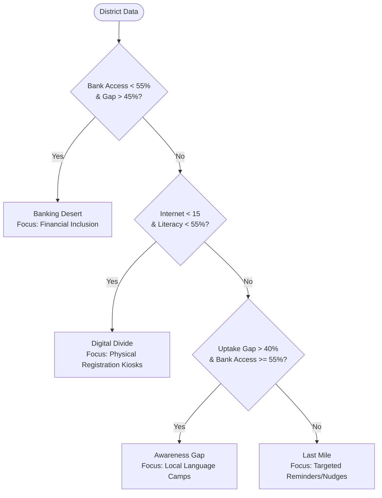

# Bridging the Enrollment Gap in PM-KISAN: A Data-Driven Analysis of Structural Barriers & Targeted Policy Interventions

**Author:** Mayank ,Shubh , Karan  
**Date:** June 13, 2026  
**Data Sources:** PM-KISAN Dashboard (May 2024 Release), India Census 2011 (PCA Table B-08), National Family Health Survey (NFHS-5, 2019-21)

---

## 1. Executive Summary

The **Pradhan Mantri Kisan Samman Nidhi (PM-KISAN)** is a landmark Direct Benefit Transfer (DBT) scheme by the Government of India, designed to provide financial support of **₹6,000 per year** to all landholding farmer families across the country. While the program has achieved massive scale, significant local enrollment gaps persist. 

This report analyzes agricultural and socioeconomic indicators across **52 selected high-priority districts in 15 states** to diagnose the drivers of this enrollment gap.

### Key Metrics Summary
* **Total Analysed Districts:** 52 districts across 15 states
* **Total Eligible Agricultural Households (HH):** 80.62 Lakh (8.06 Million)
* **Total Enrolled Households:** 48.44 Lakh (4.84 Million)
* **Total Missed Households (Uptake Gap):** 32.18 Lakh (3.22 Million)
* **Overall Average Uptake Gap:** **39.32%** (60.68% Coverage Rate)
* **Annual Entitlements Lost:** **₹1,930.80 Crore** (~$230 million USD) in missed transfers across these 52 districts alone.

> [!IMPORTANT]
> A staggering **39.3%** of eligible farming households in these 52 districts remain excluded from the program. This represents **₹1,931 Crore** in annual funds that fail to enter local rural economies, directly impacting household consumption, agricultural investment, and poverty alleviation.

---

## 2. Objective

The primary objectives of this analysis are to:
1. **Quantify the Enrollment Gap:** Identify the scale of under-enrollment across the study districts and states.
2. **Expose Structural Barriers:** Examine correlations between enrollment gaps and key district-level barriers, specifically **banking infrastructure**, **digital connectivity**, **literacy rates**, and **gender dynamics**.
3. **Segment Districts for Intervention:** Classify districts into distinct operational segments to move away from "one-size-fits-all" outreach.
4. **Formulate Actionable Policy Recommendations:** Outline tailored, segment-specific strategies to accelerate enrollment and close the financial gap.

---

## 3. Methodology

This study merges administrative records with household survey data to create a multidimensional district profile:
1. **Administrative Data:** Current enrollment counts extracted from the official **PM-KISAN Portal** (May 2024 release).
2. **Demographic Baselines:** Agricultural household estimates derived from the **Census of India 2011** (PCA Table B-08, Cultivators & Agricultural Labourers).
3. **Socioeconomic Indicators:** District-level female-headed household percentages (`women_hh_pct`), literacy rates (`literacy_rate`), and bank account access (`bank_access_pct`) sourced from the **National Family Health Survey-5 (NFHS-5)**.
4. **Digital Infrastructure:** Internet subscribers per 100 population (`internet_per100`) compiled from regional telecom data.

### Core Metrics Formulae
* **Uptake Gap (%)** = $\left(1 - \frac{\text{Enrolled Households}}{\text{Eligible Agricultural Households}}\right) \times 100$
* **Coverage Rate (%)** = $\left(\frac{\text{Enrolled Households}}{\text{Eligible Agricultural Households}}\right) \times 100$
* **Missed Households** = $\text{Eligible Agricultural Households} - \text{Enrolled Households}$
* **Annual Financial Loss (Cr)** = $\text{Missed Households} \times \text{₹6,000} \div 10^7$

---

## 4. Key Findings

### State-Level Disparities
Analysis reveals severe geographical disparities. Eastern states exhibit the highest rate of farmer exclusion:

* **Jharkhand** has the highest average enrollment gap at **55.50%**, representing **1.64 Lakh missed households** across 3 districts and **₹98.40 Crore** in lost annual transfers.
* **Odisha** follows closely at **55.27%** gap (**2.05 Lakh missed households** across 4 districts, **₹123.00 Crore** lost).
* **Assam** stands at **52.27%** gap (**2.20 Lakh missed households** across 3 districts, **₹132.00 Crore** lost).
* **Bihar** has the largest absolute volume of excluded farmers, with **6.87 Lakh missed households** across 5 districts, resulting in an annual leakage of **₹412.20 Crore**.

Conversely, **Punjab** (**19.40%** gap) and **Andhra Pradesh** (**20.37%** gap) demonstrate strong program coverage.

| State | Districts | Avg Gap (%) | Missed HH | Lost / Year (Cr) | Bank Access (%) | Literacy (%) | Internet / 100 |
| :--- | :---: | :---: | :---: | :---: | :---: | :---: | :---: |
| **Jharkhand** | 3 | 55.50% | 164,000 | ₹98.40 Cr | 52.27% | 52.13% | 14.30 |
| **Odisha** | 4 | 55.27% | 205,000 | ₹123.00 Cr | 50.88% | 49.42% | 13.60 |
| **Assam** | 3 | 52.27% | 220,000 | ₹132.00 Cr | 61.13% | 59.77% | 22.30 |
| **Bihar** | 5 | 50.76% | 687,000 | ₹412.20 Cr | 55.72% | 51.24% | 13.10 |
| **Maharashtra** | 4 | 45.75% | 211,000 | ₹126.60 Cr | 60.80% | 58.33% | 19.32 |
| **Madhya Pradesh**| 4 | 41.35% | 197,000 | ₹118.20 Cr | 51.88% | 51.02% | 15.03 |
| **West Bengal** | 4 | 39.42% | 358,000 | ₹214.80 Cr | 73.35% | 63.95% | 27.85 |
| **Uttar Pradesh** | 5 | 38.84% | 529,000 | ₹317.40 Cr | 50.32% | 55.22% | 15.48 |
| **Haryana** | 2 | 34.75% | 64,000 | ₹38.40 Cr | 78.20% | 63.75% | 48.20 |
| **Tamil Nadu** | 3 | 34.13% | 119,000 | ₹71.40 Cr | 71.97% | 70.63% | 35.27 |
| **Rajasthan** | 4 | 30.42% | 161,000 | ₹96.60 Cr | 65.83% | 56.42% | 23.35 |
| **Karnataka** | 3 | 28.90% | 102,000 | ₹61.20 Cr | 68.80% | 62.00% | 29.30 |
| **Gujarat** | 3 | 22.03% | 70,000 | ₹42.00 Cr | 77.47% | 67.70% | 38.57 |
| **Andhra Pradesh**| 3 | 20.37% | 99,000 | ₹59.40 Cr | 75.20% | 60.70% | 35.07 |
| **Punjab** | 2 | 19.40% | 32,000 | ₹19.20 Cr | 83.05% | 66.60% | 45.95 |

---

### Top 10 Priority Districts for Urgent Intervention

Ranking districts by **Uptake Gap (%)** highlights where barriers are most acute. The table below represents the "Top 10 Priority Districts" requiring immediate mobilization:

| Rank | District | State | Uptake Gap (%) | Missed HH | Lost / Year (Cr) | Barrier Segment |
| :---: | :--- | :--- | :---: | :---: | :---: | :--- |
| **1** | Nuapada | Odisha | 59.2% | 45,000 | ₹27.00 Cr | Banking Desert |
| **2** | Sahibganj | Jharkhand | 58.6% | 51,000 | ₹30.60 Cr | Banking Desert |
| **3** | Malkangiri | Odisha | 56.3% | 49,000 | ₹29.40 Cr | Banking Desert |
| **4** | Pakur | Jharkhand | 56.1% | 55,000 | ₹33.00 Cr | Banking Desert |
| **5** | Goalpara | Assam | 56.1% | 55,000 | ₹33.00 Cr | Awareness Gap |
| **6** | Araria | Bihar | 54.7% | 146,000 | ₹87.60 Cr | Banking Desert |
| **7** | Sitamarhi | Bihar | 54.2% | 169,000 | ₹101.40 Cr | Banking Desert |
| **8** | Nabarangpur | Odisha | 53.6% | 60,000 | ₹36.00 Cr | Banking Desert |
| **9** | Kokrajhar | Assam | 53.1% | 76,000 | ₹45.60 Cr | Awareness Gap |
| **10** | Rayagada | Odisha | 52.0% | 51,000 | ₹30.60 Cr | Banking Desert |

> [!TIP]
> While small districts like **Nuapada** lead in gap percentage (59.2%), populous districts like **Sitamarhi** (169k missed households) and **Araria** (146k missed households) in Bihar represent massive pockets of absolute exclusion. Interventions in Sitamarhi alone can unlock over **₹100 Crore** in annual rural purchasing power.

---

## 5. Correlation Analysis

To uncover why these gaps exist, we run a Pearson correlation analysis between a district's `uptake_gap_pct` and various development indicators:

| Socioeconomic Metric | Correlation with Enrollment Gap ($r$) | Strength & Interpretation |
| :--- | :---: | :--- |
| **Internet Subscribers per 100** | **-0.7699** | **Very Strong Negative:** Digital exclusion is the single largest barrier. Online registration requirements severely lock out low-connectivity regions. |
| **Household Bank Account Access (%)**| **-0.7584** | **Very Strong Negative:** PM-KISAN relies on Direct Benefit Transfer (DBT). Lack of bank access makes enrollment structurally impossible. |
| **Literacy Rate (%)** | **-0.5964** | **Moderate-to-Strong Negative:** Higher literacy reduces administrative and documentation friction, facilitating self-enrollment. |
| **Female-Headed Agricultural HH (%)** | **+0.2810** | **Weak Positive:** Districts with higher female-headed farming households suffer from larger enrollment gaps, hinting at systemic gender-based barriers in land record-linking. |

### Key Analytical Insights
1. **The Twin Infrastructure Bottlenecks:** Digital access ($r = -0.77$) and Banking access ($r = -0.76$) explain the vast majority of the variance in enrollment. A district cannot achieve high PM-KISAN penetration without first bridging these foundational infrastructure gaps.
2. **The Gender Access Gap:** The positive correlation ($r = 0.28$) with female-headed households is highly policy-relevant. Since PM-KISAN requires clear land title ownership, female farmers (who often face legal/cultural hurdles in inheriting or registering land titles in their names) face higher administrative exclusion.

---

## 6. District Segmentation

To implement targeted operations, we segment the 52 districts into **four operational intervention types** based on their barrier profile:

### Segment Breakdown & Profiles

| Segment Name | Districts | Avg Gap (%) | Total Missed HH | Lost / Year (Cr) | Avg Bank Access (%) | Avg Literacy (%) | Avg Internet / 100 | Primary Constraint |
| :--- | :---: | :---: | :---: | :---: | :---: | :---: | :---: | :--- |
| **Banking Desert** | 11 | 53.87% | 8.47 Lakh | ₹508.20 Cr | 49.17% | 48.66% | 12.48 | Severe lack of physical banking channels and DBT-enabled accounts. |
| **Awareness Gap** | 10 | 47.37% | 7.65 Lakh | ₹459.00 Cr | 63.68% | 59.90% | 21.42 | Infrastructure exists, but farmers lack scheme awareness or administrative support. |
| **Digital Divide** | 4 | 46.38% | 3.60 Lakh | ₹216.00 Cr | 51.02% | 50.77% | 12.57 | Low internet access combined with low literacy prevents self-registration. |
| **Last Mile** | 27 | 29.37% | 12.46 Lakh | ₹747.60 Cr | 70.46% | 62.63% | 31.50 | Minor procedural bottlenecks, administrative delays, or missing documentation. |

---

## 7. Policy Recommendations

Moving from generic publicity campaigns to segment-specific structural interventions will yield the highest return on administrative effort:

### 1. Banking Deserts (Target: 11 Districts | 8.47 Lakh Missed HH)
* **Strategy:** Financial Inclusion Campaigns.
* **Actions:**
  * Deploy **Mobile Banking Vans** and collaborate with India Post Payments Bank (IPPB) to open zero-balance, Aadhaar-seeded accounts directly at the village level.
  * Train and incentivize local **Business Correspondents (Bank Mitras)** with a commission per PM-KISAN account successfully seeded.

### 2. Digital Divide (Target: 4 Districts | 3.60 Lakh Missed HH)
* **Strategy:** Assisted Physical Registration.
* **Actions:**
  * Mandate **Common Service Centres (CSCs)** and local gram panchayat offices to host assisted registration drives.
  * Develop a simplified, offline paper-based intake process at the village council level, which is subsequently uploaded in batches by block officers.

### 3. Awareness Gaps (Target: 10 Districts | 7.65 Lakh Missed HH)
* **Strategy:** Localized Communication & Trust Building.
* **Actions:**
  * Launch **vernacular radio, audio-visual mobile vans, and wall paintings** detailing scheme eligibility and benefits in local dialects (e.g., Angika, Maithili, Odia).
  * Mobilize local community institutions (Self-Help Groups under NRLM, ASHAs, and Anganwadi workers) to identify and register non-enrolled farmers.

### 4. Last Mile (Target: 27 Districts | 12.46 Lakh Missed HH)
* **Strategy:** Administrative Clean-up & Friction Removal.
* **Actions:**
  * Conduct **Gram Sabhas (village assemblies)** specifically dedicated to resolving minor mismatch errors (Aadhaar name spelling mismatches vs. land records).
  * Deploy automated SMS alerts in regional languages notifying farmers of pending documents or failed transactions.

### 5. Cross-Cutting Gender Intervention
* **Strategy:** Gender-Inclusive Land Records.
* **Actions:**
  * Implement a fast-track administrative track for joint land titling and ease documentation requirements for female cultivators who do not have formal land titles in their name but are verified as joint family farmers by local revenue officers (Patwaris).

---

## 8. Conclusion

This data-driven diagnostic of PM-KISAN enrollment gaps shows that program under-performance is rarely due to lack of farmer interest, but rather due to severe, localized structural barriers. 

By prioritizing the **Top 10 Districts** (particularly in Bihar, Odisha, and Jharkhand) and deploying the **segmented policy framework**, policymakers can unlock up to **₹1,930 Crore in annual household transfers**. This will not only expand PM-KISAN coverage but also catalyze rural economic recovery, improve agricultural investments, and ensure social safety nets reach the last mile.

---

### Interactive Visualisation
An interactive geospatial map showing the uptake gaps and segmentation across all 52 districts has been generated as part of this project. You can access it here:
* [Interactive District Map (pmkisan_map.html)](file:///home/money/.gemini/antigravity-cli/brain/eb836db5-4feb-4cdf-a7b5-faa55e87e5b8/pmkisan_map.html)
